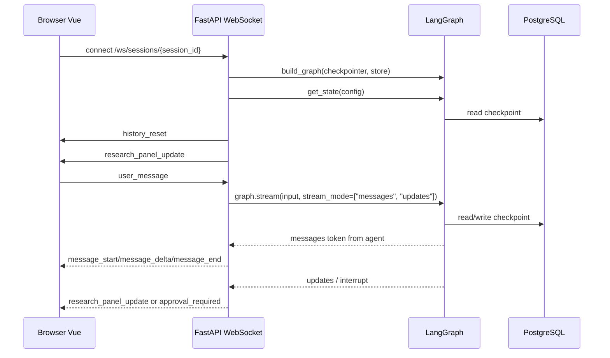

# 前端化新增代码说明

这份文档解释本项目为了做 Web 前端新增的代码，以及这些代码在整个 Agent 运行链路里的作用。它不把前端当成一个独立玩具页面，而是把它看成 CLI 之外的第二个入口：前端通过 FastAPI 和 WebSocket 调用同一个 LangGraph 图、同一个 PostgreSQL checkpoint、同一个 research session。

## 总览

前端化新增的核心目录有两个：

```text
src/personal_research_agent/api/
src/personal_research_agent/web/
```

`api/` 是后端 Web 层，负责把原来的 CLI 能力暴露成 HTTP 接口和 WebSocket 接口。它不重新实现 Agent，只负责创建 session、读取研究面板、读写草稿、处理来源勾选、连接 LangGraph 图。

`web/` 是浏览器页面层，负责显示左侧工作区树、中间聊天窗口、右侧研究面板和草稿编辑器。它不直接读本地文件、不直接连数据库，所有数据都通过 `api/` 提供。

整体调用关系是：

```mermaid
flowchart LR
    browser["浏览器页面 web/"] --> http["HTTP 接口 api/app.py"]
    browser --> ws["WebSocket /ws/sessions/{session_id}"]
    http --> session["memory/sessions/*/research_session.json"]
    http --> testdir["test/资料文件夹"]
    ws --> graph["build_graph()"]
    graph --> checkpoint["PostgreSQL checkpoint"]
    graph --> store["PostgreSQL store"]
    graph --> rag["rag_chunks"]
```

## 依赖与打包

前端化在 `pyproject.toml` 里增加了 FastAPI 和 Uvicorn：

```toml
fastapi
uvicorn[standard]
```

FastAPI 负责提供 HTTP API 和 WebSocket。Uvicorn 是 ASGI 服务器，用来启动这个 Web 应用。

`pyproject.toml` 里还配置了 package data：

```toml
[tool.setuptools.package-data]
personal_research_agent = ["web/*.html", "web/*.css", "web/*.js"]
```

这表示如果以后项目被安装成 Python 包，`web/` 里的静态文件也会跟着包一起分发。否则 `FastAPI` 找不到 `index.html`、`app.js`、`styles.css`。

## 后端入口 api/app.py

`src/personal_research_agent/api/app.py` 是 Web 后端主入口。这里创建了 FastAPI 实例：

```python
app = FastAPI(title="reexamAgent Web", version="0.1.0")
```

这个 `app` 就是 Uvicorn 启动时加载的对象。启动命令里的 `personal_research_agent.api.app:app` 指的就是这个变量。

`STATIC_DIR` 指向：

```python
src/personal_research_agent/web
```

后端通过：

```python
app.mount("/static", StaticFiles(directory=STATIC_DIR), name="static")
```

把 `web/app.js` 和 `web/styles.css` 暴露给浏览器。浏览器访问 `/static/app.js` 时，FastAPI 会从这个目录返回文件。

`GET /` 返回 `index.html`：

```python
@app.get("/")
def index() -> FileResponse:
    return FileResponse(STATIC_DIR / "index.html")
```

所以打开 `http://127.0.0.1:8000/` 时，看到的不是后端 JSON，而是前端页面。

## Session 接口

`GET /sessions` 返回所有 research session 的摘要。它内部调用：

```python
list_sessions()
```

这个函数会扫描 `memory/sessions/` 目录，把每个 session 下的 `research_session.json` 读出来。

`POST /sessions` 创建新 session。前端表单里的学校、专业、年份会被传给：

```python
create_session(...)
```

如果用户填了学校和专业，后端还会创建或复用对应的资料输出目录：

```python
test/学校专业
```

然后把这个路径写入 session 的 `output_dir`。这就是为什么同一个“河南农业大学人工智能”工作区下面可以挂多个 session。

`GET /sessions/{session_id}` 读取单个 session 摘要。前端目前主要用 `/sessions` 和 `/folders`，这个接口更多是给调试和后续扩展用。

`DELETE /sessions/{session_id}` 删除 session 目录。注意它只删：

```text
memory/sessions/{session_id}
```

不会删除 `test/学校专业` 里的资料和草稿。这样做是为了避免误删用户收集的复试资料。

## 工作区树接口

`GET /folders` 是左侧工作区树的数据来源。它不只是看 session，还会扫描真实的：

```text
test/
```

这个接口调用：

```python
folder_summary_from_sessions(list_sessions())
```

实际逻辑在 `api/panel.py` 里。它会先扫描 `test/` 下的一级资料文件夹，再把 session 按 `output_dir` 挂到对应文件夹下面。

返回的数据结构大概是：

```json
{
  "folders": [
    {
      "output_dir": "test/河南农业大学人工智能",
      "name": "河南农业大学人工智能",
      "session_count": 2,
      "sessions": [
        {
          "session_id": "session-...",
          "title": "河南农业大学-人工智能-2026"
        }
      ]
    }
  ]
}
```

这就是前端左栏显示“文件夹 -> session”的依据。以前只按 session 聚合，所以空资料文件夹不会显示；现在扫描 `test/`，所以即使文件夹下暂时没有 session，也能出现在工作区里。

如果某个 session 没有 `output_dir`，后端会把它放进特殊分组：

```text
未归档 Session
```

这样旧 session 不会从前端消失。

## 研究面板接口

`GET /sessions/{session_id}/research-panel` 返回右侧“研究面板”的数据。它调用：

```python
build_research_panel(session_id)
```

这个函数会读取 `research_session.json`，然后整理成适合前端展示的结构。

研究面板里最重要的数据有：

```text
current_task
open_gaps
search_progress
search_history
candidate_sources
selected_sources
extracted_sources
draft_status
output_dir
```

这些字段不是模型直接生成给前端的，而是后端从 session 文件里整理出来的“视图模型”。这样前端不用理解复杂的业务文件结构，只要按字段展示即可。

`candidate_sources` 会把原始候选来源和初筛结果合并起来，并给每条来源生成 `source_key`。前端勾选来源时，提交的就是这个 `source_key`。

## 来源勾选接口

`POST /sessions/{session_id}/selected-sources` 用于保存前端勾选的候选来源。

前端发送：

```json
{
  "source_keys": ["q1|1|https://example.com/a"]
}
```

后端会从 `candidate_sources` 里找到对应来源，再结合 `reviewed_sources` 里的初筛信息，写入：

```text
selected_sources
```

这个接口让“保留哪些复试资料来源”变成明确的用户选择，而不是让模型自己猜。后续抽取正文、生成草稿，都应该优先基于 `selected_sources`。

## 草稿接口

`GET /sessions/{session_id}/drafts` 列出当前 session 输出目录下的 Markdown 草稿。

这个接口只会读取 session 的 `output_dir` 下的 `.md` 文件。例如：

```text
test/河南农业大学人工智能/*.md
```

`GET /sessions/{session_id}/drafts/{filename}` 读取某个草稿内容。

`PUT /sessions/{session_id}/drafts/{filename}` 保存草稿内容。

保存草稿时后端会检查文件名，只允许保存 `.md`，并且路径必须位于当前 session 的 `output_dir` 里面。这个限制是为了防止前端传一个恶意路径去覆盖项目里的其他文件。

## WebSocket 聊天入口

前端聊天不是通过普通 HTTP POST 实现的，而是通过：

```text
/ws/sessions/{session_id}
```

这是因为聊天需要流式输出、人工审批、复试搜索 interrupt，这些都更适合用 WebSocket。

WebSocket 连接建立后，后端会做三件事：

```python
graph = build_graph(checkpointer=checkpointer, store=store)
await send_history(...)
await send_panel(...)
```

第一步构建 LangGraph 图。这里和 CLI 用的是同一个 `build_graph()`，所以前端和 CLI 的 Agent 能力是同一套。

第二步 `send_history` 从 checkpoint 里读取历史消息，发给前端恢复聊天窗口。这个能力解决了“浏览器刷新后历史会话消失”的问题。

第三步 `send_panel` 发送右侧研究面板数据，让前端一打开 session 就能看到当前任务状态。

## 前端和 CLI 的关系

CLI 和前端是两个入口，但底层调用同一个图。

CLI 的路径是：

```text
cli.py -> graph.invoke(...)
```

CLI 会等待整轮图执行结束，然后打印最后一条 AIMessage。

前端的路径是：

```text
api/app.py -> graph.stream(...)
```

前端会边执行边收到模型 token，所以浏览器里能看到流式输出。

这两个入口共享：

```text
同一个 build_graph()
同一个 thread_id/session_id
同一个 checkpoint
同一个 store
同一个工具注册表
```

区别只是“消费结果的方式”不同。CLI 是一次性消费最终结果，前端是流式消费图事件。

## 流式输出实现

前端发消息后，后端不再调用：

```python
graph.invoke(...)
```

而是调用：

```python
graph.stream(..., stream_mode=["messages", "updates"])
```

`messages` 模式会返回模型生成的 token。后端把这些 token 转成 WebSocket 事件：

```text
message_start
message_delta
message_end
```

前端收到 `message_start` 时创建一个新的 Agent 气泡。收到 `message_delta` 时，把文本追加到这个气泡里。收到 `message_end` 时，说明本次回答结束。

`updates` 模式会返回节点执行完成后的状态更新。它用于处理非流式节点消息和 interrupt。比如来源确认节点直接返回一条完整 AIMessage，这种消息不一定走 token 流，就需要从 `updates` 里兜底发给前端。

## 为什么只显示 agent 节点的流

LangGraph 里不止 `agent` 节点会调用模型。比如：

```text
summarize_if_needed
save_long_term_memory
```

这些节点也可能产生 LLM token。如果不加过滤，前端会看到内部摘要、长期记忆判断 JSON，例如：

```json
{"save": false, "reason": "..."}
```

所以后端增加了：

```python
is_user_visible_stream(metadata)
```

它只允许：

```python
metadata["langgraph_node"] == "agent"
```

的 token 推给浏览器。内部节点仍然运行，只是不显示给用户。

## 历史消息恢复

刷新浏览器时，Vue 内存里的 `messages` 会被清空。这不是 checkpoint 丢了，而是前端页面重新加载后本地状态没了。

为了解决这个问题，WebSocket 建连后会调用：

```python
graph.get_state(config)
```

这里的 `config.configurable.thread_id` 就是当前 session id。LangGraph 会根据这个 thread_id 从 checkpoint 中恢复状态。

后端拿到 state 后，读取：

```python
state.values["messages"]
```

再把 `HumanMessage`、`AIMessage`、`ToolMessage` 转成前端能显示的 JSON。前端收到：

```text
history_reset
```

就用这批消息替换当前聊天窗口。

## 工具消息怎么显示

历史消息里可能有 `ToolMessage`。比如模型调用 `read_file` 后，工具返回“文件不存在”。

后端把工具消息序列化成：

```json
{
  "role": "tool",
  "content": "read_file\n文件不存在"
}
```

前端根据 `role` 显示不同标签：

```text
你
Agent
工具
```

这样工具执行结果不会被误认为是 Agent 的自然语言回复。

## 人工审批与 interrupt

工具审批和复试搜索决策仍然走 LangGraph 的 `interrupt()`。

当图执行到 interrupt 时，`graph.stream()` 会在 `updates` 里返回：

```text
__interrupt__
```

后端把它转换为前端事件：

```text
approval_required
reexam_decision_required
```

前端收到 `approval_required` 就显示“批准/拒绝”。用户点按钮后，前端通过 WebSocket 发回：

```json
{
  "type": "approval_response",
  "value": "yes"
}
```

后端再调用：

```python
Command(resume=value)
```

让 LangGraph 从暂停点继续执行。

复试搜索循环也是同理。用户选择“继续补搜 / 来源确认 / 停止”后，前端发送 `reexam_decision`，后端用 `Command(resume=...)` 恢复图。

## api/panel.py 的作用

`api/panel.py` 是一个“后端视图层”。它不执行 Agent，也不调用模型，只负责把本地状态整理成前端好展示的数据。

它做了三类事情：

```text
构建研究面板
构建工作区树
列出草稿文件
```

`build_research_panel(session_id)` 读取 `research_session.json`，把搜索进度、资料缺口、候选来源、已确认来源、草稿状态整理成一个面板对象。

`folder_summary_from_sessions(sessions)` 扫描 `test/` 下的资料文件夹，并把 session 按 `output_dir` 归进去。

`list_draft_files(session)` 只列出当前 session 输出目录下的 Markdown 文件，供右侧“草稿”标签页使用。

## api/schemas.py 的作用

`api/schemas.py` 存放 FastAPI 请求体模型。它使用 Pydantic 定义前端传给后端的数据结构。

例如创建 session 的请求体是：

```python
CreateSessionRequest
```

它包含：

```text
school
major
year
title
research_goal
session_id
```

保存草稿的请求体是：

```python
DraftUpdate
```

勾选来源的请求体是：

```python
SelectSourcesRequest
```

这些 schema 的作用是让接口输入更明确。如果前端传的数据结构不对，FastAPI 会自动返回参数错误。

## web/index.html 的作用

`web/index.html` 是页面结构。它定义了三大区域：

```text
左侧 sidebar
中间 chat-panel
右侧 research-panel
```

左侧显示品牌、创建 session 表单、工作区树。

中间显示聊天历史、人工审批区域、输入框。

右侧显示研究面板和草稿编辑器。右侧通过 tabs 切换：

```text
研究面板
草稿
```

这个文件主要写结构，不负责复杂逻辑。复杂交互在 `app.js` 里。

## web/app.js 的作用

`web/app.js` 是 Vue 应用逻辑。它负责维护浏览器里的状态：

```text
sessions
folders
currentSessionId
messages
interrupt
panel
selectedSourceKeys
draftContent
```

页面加载时，`mounted()` 会调用：

```javascript
refreshAll()
```

这个函数同时请求 `/sessions` 和 `/folders`，然后选择一个默认 session 进行连接。

用户点击 session 时，调用：

```javascript
selectSession(sessionId)
```

它会清空当前页面消息、连接新的 WebSocket、刷新右侧研究面板。

WebSocket 的事件处理集中在：

```javascript
handleSocketEvent(event)
```

这里根据事件类型更新前端状态。比如 `history_reset` 恢复历史，`message_delta` 追加流式文本，`approval_required` 显示审批面板。

## web/styles.css 的作用

`web/styles.css` 是页面样式。它负责让页面固定在浏览器视口内，不因为右侧内容过长而把聊天输入框挤到下面。

关键布局是：

```css
#app {
  display: grid;
  grid-template-columns: 280px 1fr;
  height: 100vh;
}
```

整个页面分成左侧栏和主工作区。

主工作区再分成：

```css
.workspace {
  grid-template-columns: minmax(0, 1fr) 380px;
}
```

左边是聊天，右边是研究面板。

聊天区内部使用 flex 布局。消息列表滚动，输入框固定在底部：

```css
.messages {
  flex: 1;
  overflow: auto;
}

.composer {
  flex: 0 0 auto;
}
```

这就是后来修复“聊天框被右侧资料挤到下面”的关键。

## tests/test_api.py 的作用

`tests/test_api.py` 是前端化接口的回归测试。它不只是测页面能不能打开，还测几个容易坏的关键行为。

已经覆盖的点包括：

```text
/health 正常
/ 返回前端页面
research panel 结构稳定
工作区树能扫描 test/ 并归组 session
来源勾选能写入 selected_sources
流式 token 能变成 message_delta
内部 LLM token 不会泄露给前端
非流式 AIMessage 能兜底显示
历史消息能序列化并发送 history_reset
```

其中“内部 LLM token 不泄露”是最近修过的 bug。这个测试保证以后不会再把 `# 会话摘要` 或 `{"save": false}` 推到前端聊天气泡里。

## 相关稳定性改动

为了让 Web 前端稳定运行，还做了两个和前端强相关的后端修复。

第一个是 `cli.py` 的 `open_runtime()`。它原来会把图执行过程中的异常也误认为 Postgres 初始化失败，导致出现：

```text
generator didn't stop after throw()
```

现在它只在“进入 Postgres runtime 失败”时降级到内存模式。图已经开始执行后的异常会正常抛出，方便 WebSocket 返回真实错误。

第二个是 `graph.py` 里的工具错误处理。`ToolNode` 现在配置了：

```python
handle_tool_errors=tool_error_message
```

这样工具读文件失败、文件不存在等错误，会变成 `ToolMessage` 返回给模型，而不是直接让整个 WebSocket 会话崩掉。

## 启动方式

后端启动命令是：

```powershell
cd E:\study\LangGraph
.\.venv\Scripts\uvicorn.exe personal_research_agent.api.app:app --reload --host 127.0.0.1 --port 8000
```

浏览器打开：

```text
http://127.0.0.1:8000/
```

如果用了 `--reload`，修改 Python 文件后 Uvicorn 通常会自动重启。修改前端静态文件后，刷新浏览器即可。

## 一次完整聊天流程

一次前端聊天的完整链路是：



最核心的一点是：前端不是另起一个 Agent，它只是换了一种交互方式来驱动同一个 LangGraph Agent。

## 你读代码时的推荐顺序

建议按这个顺序读：

```text
1. web/index.html
2. web/app.js
3. api/app.py
4. api/panel.py
5. api/schemas.py
6. tests/test_api.py
```

先看 `index.html`，你会知道页面有哪些区域。再看 `app.js`，你会知道前端状态怎么变。然后看 `api/app.py`，你会明白前端每个动作对应哪个后端接口。最后看 `panel.py` 和测试，就能理解工作区树、研究面板、历史恢复和流式输出是怎么被稳定下来的。
